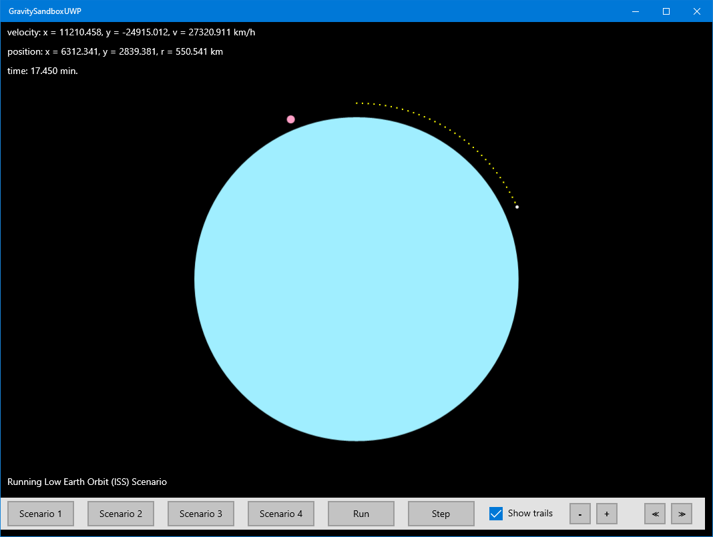

# Gravity-Sandbox
Very old XAML/UWP app. Porting to various platforms to test and learn.

## Completed and potential ports
- [x] UWP on Windows 10
- [ ] Unity (change to spheres in 3D)
- [ ] Win2D on UWP
- [ ] WinUI 3 on .NET 5
- [ ] (Low priority) Xamarin/MAUI on Android Phone or iPad

## General TBDs
- [x] Get the simulation running again
- [x] Perf of gravity calculations (done), XAML modifications (some idea, but these run async)
- [x] Run gravity calculations on multiple threads? Not yet, for now we're automatically slowing the simulation when it gets too big to run at full frame rate
- [ ] New scenarios: Orbits, stars and planets, black holes and stars, colliding "galaxies"
    - [ ] This requires a generalization of the simulation space (from working in abstract units to supporting multiple simulation spaces, including ones with real-world units)
    - [ ] Will need to change the scenario selection UI from buttons to a menu
- [x] Crashing bug when scenarios are cleared and a worker thread is still working
- [x] Bug: Runaway explosion of UI threads when simulation doesn't complete in per frame time (Was: Figure out the animation/memory problem that started ~2016)
- [x] Bug: Suspend/resume crashes (??) when resuming after system turns off screen
- [x] Display loaded scenario name when first loaded
